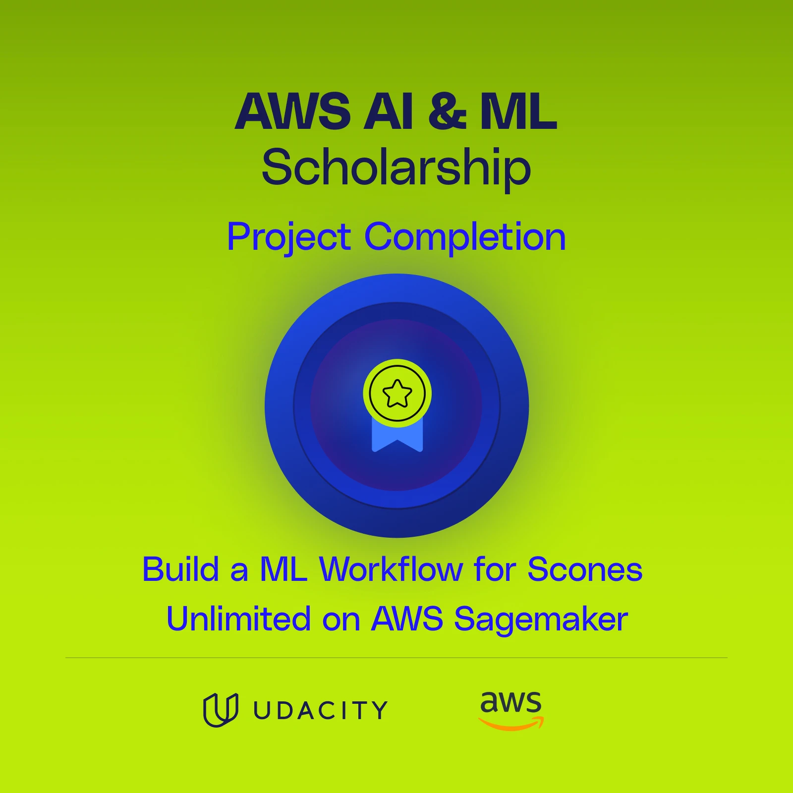

# AWS Scones Unlimited - Vehicle Image Classification

## Project Result  
This project delivers a machine learning model capable of distinguishing between bicycles and motorcycles in images. It helps Scones Unlimited optimize delivery operations by routing drivers with bicycles to nearby orders and motorcyclists to farther destinations, improving efficiency.

## Project Overview  
In this project, I built an image classification system using AWS SageMaker to identify delivery vehicles (bicycles or motorcycles). The system is scalable and integrates seamlessly with the Scones Unlimited ecosystem through AWS Lambda functions and Step Functions, enabling automated routing decisions based on the type of vehicle a driver uses. 

The image classification model achieves an accuracy of 84%, and the project includes monitoring mechanisms to track model performance and handle changes in data over time. Below are the detailed steps involved in building and deploying the model.

---

## Project Steps

### 1. Data Staging  
- **Dataset**: I used the CIFAR-100 dataset, which contains 100 classes of images. From this dataset, I filtered and selected only two classes: bicycles and motorcycles.  
- **Data Preparation**: I organized the data into training and testing sets, saving them in appropriate folders (`train`, `test`).  
- **Upload to S3**: After preparing the dataset, I uploaded it to an Amazon S3 bucket for use in the training process.

### 2. Model Training and Deployment  
- **Training the Model**:  
  - I utilized the built-in image classification algorithm from SageMaker's image URIs.  
  - I tuned the hyperparameters and trained the model for 30 epochs, achieving 84% accuracy on the validation set.  
- **Model Deployment**:  
  - I enabled data capture for all incoming samples sent to the model during inference and saved the data in the `data_capture` directory in the S3 bucket.  
  - Deployed the model to an endpoint using the `ml.m5.xlarge` instance type.
  - Created a predictor that interacts with the SageMaker endpoint to perform real-time inferences.

### 3. Lambda Functions and Step Function  
- **Lambda Functions**:  
  I created three Lambda functions to orchestrate the inference process through AWS Step Functions:
  1. **Data Serialization Function**: Takes the input image, serializes it, and passes it to the next step.
  2. **Classification Function**: Takes the serialized image from the first step, decodes it, and performs inference using the deployed model. The output is passed to the next step.
  3. **Filtering Function**: Filters the inference results based on a threshold. It checks the probability for each class (bicycle and motorcycle) and determines the final output depending on which class surpasses the threshold.
  
- **Step Function**:  
  AWS Step Functions orchestrate the Lambda functions to form a smooth and automated pipeline for vehicle image classification.

### 4. Testing and Evaluation  
- **Test Data**: I took several examples from the test dataset and passed them through the Step Functions to evaluate the workflow.  
- **Model Evaluation**: Using the captured inferences from the data capture directory, I generated plots to visualize the performance of the model.  
- **Result**: The Step Function successfully worked end-to-end, identifying vehicles as either bicycles or motorcycles.

---

## Badge of Completion  

---

Feel free to contact me for any questions or further details about the project!
